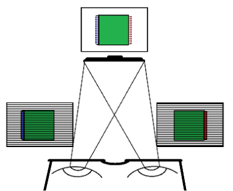
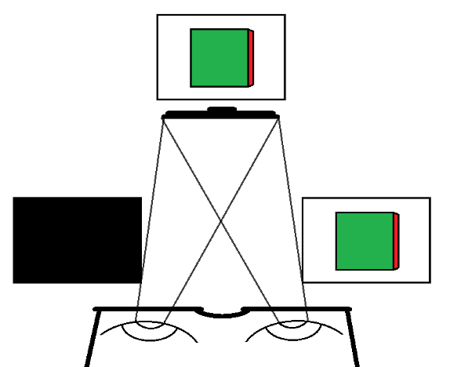
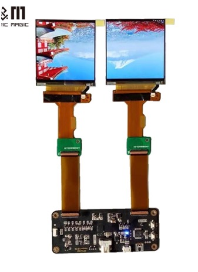
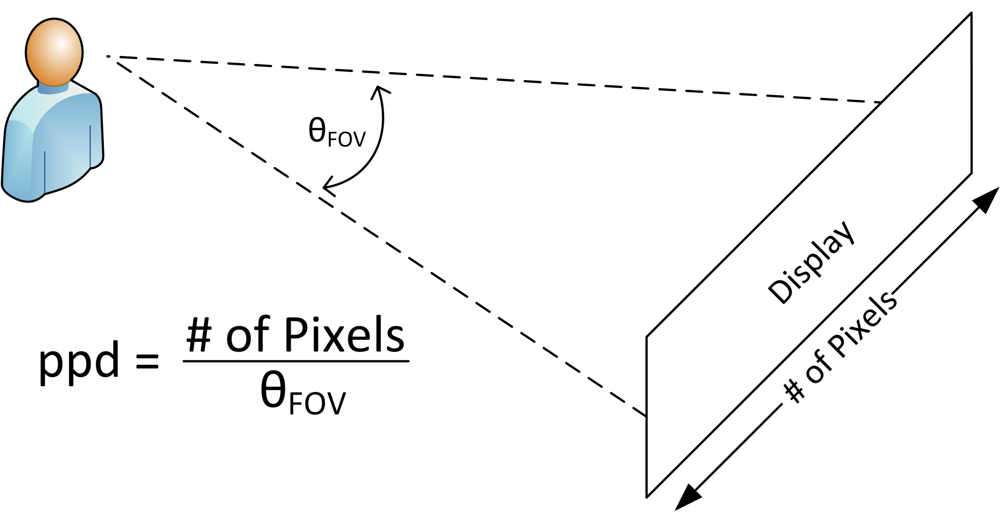

When visualising 6DoF experiences, there is a wider range of platforms which can be targetted.
This include:

- Projection-based technologies
- Display-based technologies, including Head-Mounted Displays (HMD).

](https://upload.wikimedia.org/wikipedia/commons/6/6d/CAVE_Crayoland.jpg)

## Projection based technology

Is based on multiple projectors on flat
or curved surfaces. There are multiple types of configurations including:
- Flat area
- Room-sized cube
- Immersive screen

By incorporating motion sensors, it allows
to record the position (e.g. head, hands) of the viewer. 

Limitation to one user.

## Display based technology

Uses LCD/LED or other technologies for displaying the pixels.

The technologies for stereoscopic viewing include two different methods for sending information
to both eyes:

- Passive 3D 
- Active 3D

{alt="passive 3D" width="200px"}
{alt="active 3D" width="200px"}

### Passive 3D

Passive technologies blend two frames in one.

Frame display alternate lines of the frame meant both for the left and the right eye. 

Passive 3D glasses have different polarization on each lens that fits with their respective lines.

Glasses are more cheaper. But they support less resolution.

![Circularly polarized glasses, used for stereoscopic viewing. &copy; Dave Pape (CC BY-SA 4.0 Wikimedia Commons)[https://commons.wikimedia.org/wiki/File:Circularly_polarized_glasses.jpg]](https://upload.wikimedia.org/wikipedia/commons/6/66/Circularly_polarized_glasses.jpg)

### Active 3D

Alternate displaying frames meant for the right eye and the left eye. Glasses are synchronized. 

Shutters darken the individual lenses in tandem with the image on the screen.

This technology is more expensive but has better resolution.

![Visualization how active 3D TVs work &copy; (CC BY-SA 4.0 Wikimedia Commons)[https://en.wikipedia.org/wiki/Active_shutter_3D_system#/media/File:Active-3d-shutter-technology.gif]](https://upload.wikimedia.org/wikipedia/commons/b/bb/Active-3d-shutter-technology.gif)

## 3D screens
 
3D TVs no longer produced since 2016, and there were 
multiple reasons for its failure.

Current developments for improving 3D screens include
improving the viewing experience without using 3D glasses.

## VR headsets

Headsets are built using two high-resolution OLED or LCD monitors, and other sensors.
They provide separate images for each eye.

There are two attriutes of their specifications worth looking at:

### Refresh rates
The majority of VR headset refresh rates range from 60 hz to 140 hz. This means that the image is refreshed 90 times per second. 

However, some high-end headsets have a refresh rate of 120Hz or even 144Hz.

### Resolution

Headset resolution is often described using pixels per degree  (ppd).

In a similar way that pixel density is the number of physical pixels per inch (ppi) on a screen or display of a device, ppd measures the screen's resolution as seen from an angle. 

Headsets can be compared according to these [specifications](https://en.wikipedia.org/wiki/List_of_virtual_reality_headsets
).

## Challenges for development 

When distribution for 6DoF experience, it is important
to keep these specifications into consideration.

