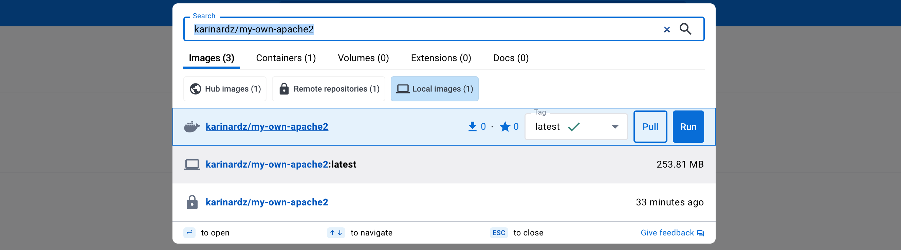
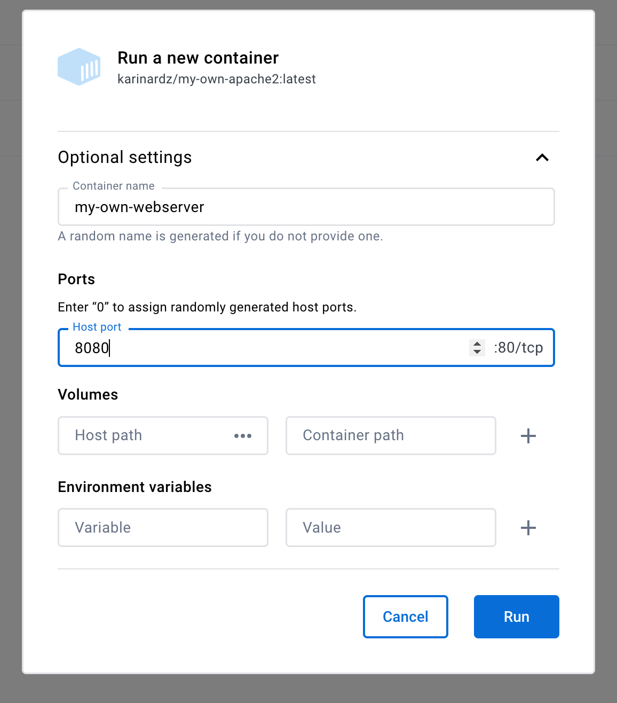

## Create a basic web server image in Docker


For this excercise, we will use Docker.

To start we either search in Docker Hub

{alt='Download my-own-apache2.'}

Or pull a docker image fromt the command line:

```console
foo@bar:~$ docker pull karinardz/my-own-apache2
```

Once you pull the image you should be able to see this in your docker list of images

```console
foo@bar:~$ docker image ls
REPOSITORY                         TAG       IMAGE ID       CREATED          SIZE
karinardz/my-own-apache2           latest    38e2bbc9b07c   46 minutes ago   254MB
```


## Start the web server container

To start the new server

Either start the image in Docker Desktop. 


{alt='Start my-own-apache2.'}

Please note to add your own container name, and add a port to run the webserver,
for example, 8080 as shown in the image.

Or start the container from the command line

```console
foo@bar:~$ docker run -dit --name my-own-webserver -p 8080:80 my-own-apache2
```


Once you pull the image you should be able to see this in your docker list of images

```console
foo@bar:~$ docker container ls
CONTAINER ID   IMAGE                              COMMAND                  CREATED         STATUS         PORTS                    NAMES
ec432b277b4c   karinardz/my-own-apache2           "httpd-foreground"       9 seconds ago   Up 8 seconds   0.0.0.0:8080->80/tcp     my-own-webserver
```


## Run the website on a browser

The container has a basic apache httpd web server installed.

To test this, you can access on a web browser the following address:

http://localhost:8080


To access the files which create this website, it is possible to access this from
Docker Desktop by navigating to 

