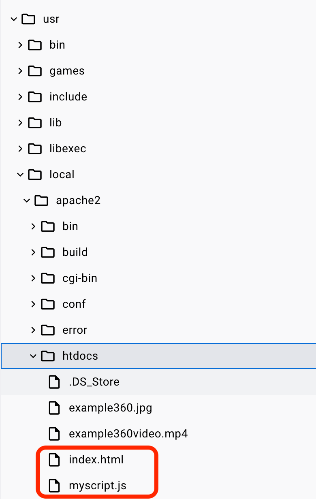

---

**Aim:**

This tutorial will allow you to create a basic locally hosted website which allows
a user to visualise and interact with a 360&deg; image.

**Requirements:**

You will need basic awareness of how a webserver works, as well
as basic knowledge of HTML and Javascript.

---
# Using online viewers

Using a 360 camera, take a 360 image.
Here is the image we took during class is available here.

{alt='Class 360 image.'}


<iframe width="800" height="600" allowfullscreen style="border-style:none;" src="https://cdn.pannellum.org/2.5/pannellum.htm#panorama=https%3A//karina-rodriguez.github.io/2024-XR-interoperability/fig/2024_class_360.JPG&title=Class%202024%20VR%20Systems%20UoB&autoLoad=true"></iframe>


You will need to download them onto the computer, process them and publish the result to be viewed in different formats. 

Once you have your spherical panorama stitched files make it available via a URL using https://brighton.domains/ or [Wikimedia](https://commons.wikimedia.org/w/index.php?title=Special:CreateAccount&returnto=Main+Page) (you need to create an account).

Once the file is uploaded get the URL link of the image and past it into the first box of [Pannellum viewer](https://pannellum.org/documentation/overview/tutorial/).

Congratulations you are viewing your first spherical panorama photograph online!

Get the URL link of the result of the embedding code and paste it into one of your social media or personal pages if you want to.


There are many interactive viewers for spherical panorama photographs some more basic while others more advanced.[The Pannellum viewer](https://pannellum.org) is a good starting point because it is open source and customisable. With Pannellum and other viewers, it will also be possible to create Virtual tours, however, it is out of the scope of this exercise to learn how to create this type of visualisation. If you want to further explore this type of publication here is a list of tools that you may be able to use for your project:


- Pannellum [Online](https://pannellum.org/documentation/overview/tutorial/) or [self- hosted](https://pannellum.org/download/).
- [Google Streetview](https://www.google.com/streetview/) 
- [Marzipano](https://www.marzipano.net/)
- [Asteroom](https://www.asteroom.com/en/photographers)
- [Matterport](https://matterport.com/en-gb).


# 360 on server
## Create a basic web server image in Docker


For this exercise, you can either use:

- web server in [brighton.domains](https://brighton.domains/)
- Docker container with a web server.

### Using brighton.domains

Using https://brighton.domains/, 
access the server to create a new
subdomain and create a folder to serve the subdomain.

For example, test.yourname.brighton.domains. 

In the folder, include an
index.html which displays a basic hello world.


### Using Docker
To start we either search in Docker Hub

{alt='Download my-own-apache2.'}

Or pull a docker image fromt the command line:

```console
foo@bar:~$ docker pull karinardz/my-own-apache2
```

Once you pull the image you should be able to see this in your docker list of images

```console
foo@bar:~$ docker image ls
REPOSITORY                         TAG       IMAGE ID       CREATED          SIZE
karinardz/my-own-apache2           latest    38e2bbc9b07c   46 minutes ago   254MB
```


## Start the web server container

To start the new server

Either start the image in Docker Desktop. 


{alt='Start my-own-apache2.'}

Please note to add your own container name, and add a port to run the webserver,
for example, 8080 as shown in the image.

Or start the container from the command line

```console
foo@bar:~$ docker run -dit --name my-own-webserver -p 8080:80 my-own-apache2
```


Once you pull the image you should be able to see this in your docker list of images

```console
foo@bar:~$ docker container ls
CONTAINER ID   IMAGE                              COMMAND                  CREATED         STATUS         PORTS                    NAMES
ec432b277b4c   karinardz/my-own-apache2           "httpd-foreground"       9 seconds ago   Up 8 seconds   0.0.0.0:8080->80/tcp     my-own-webserver
```


## Run the website on a browser

The container has a basic apache httpd web server installed.

To test this, you can access on a web browser the following address:

[http://localhost:8080](http://localhost:8080)

This web server has been loaded with a basic html page, and some 
javascript which uses the [VR View for the Web](https://developers.google.com/vr/develop/web/vrview-web).

{alt='Local host with 360 image.'}

## Modify the HTML/JavaScript code to add interaction


Docker Desktop can be used to access the files which are used for the website.
To access this, navigate to: Containers -> my-own-webserver 

You should be able to access the interface with the various tabs:
Logs, Inspect, Terminal, Files, Stats

If you click on 'Files', you will be able to access all the filesystem in your container.
Note this is only in memory, as it is not in your local filesystem.

Using the interface, navigate to: /usr/local/apache2/htdocs

### Edit webpage and Javascript

Whatever path you used for the web server,
you will need to create an index.html and a script.js

See below for more details.

{alt='Edit HTML.'}

To open index.html, double click on it.

You will see the HTML code which renders the web page. In particular, there 
DIV element which allows for the 360&deg; image to be render. 

For more information in tags, see [HTML documentation](https://www.w3schools.com/tags/tag_html.asp).


```HTML
<html>
    <head>
    <script src="https://storage.googleapis.com/vrview/2.0/build/vrview.min.js"></script>
    <!-- Include a script with code to add images and interactivity -->
    <script src="myscript.js"></script> 

    </head>
    <body>
    <!--  an HTML DIV tag -->
    <div id='vrview'></div>
    </body>
    
</html>
```


::::::::::::::::::::::::::::::::::::: challenge 

## Challenge: Modify the HTML code

Try adding some HTML element to the site, such as some text.


:::::::::::::::::::::::: solution 

## Code to add title
 
 ```HTML
    <h1>Welcome to my 360&deg; image</h1>
```


:::::::::::::::::::::::::::::::::

::::::::::::::::::::::::::::::::::::::::::::::::::::::::::::::::::::::::::::::::


Most functionality takes place in myscript.js, so double click on it.

To learn more about Javascript, access the [Javascript documentation](https://developer.mozilla.org/en-US/docs/Web/JavaScript).

You will find the following code:

 ```Javascript

window.addEventListener('load', onVrViewLoad);

function onVrViewLoad() {
  // Selector '#vrview' finds element with id 'vrview'.

  var vrView = new VRView.Player('#vrview', {
    image: 'example360.jpg',
    width: '100%',
    height: '100%',
    is_stereo: false
  });
}
```

This takes a 360 image and renders it with a width and height of 100%.


::::::::::::::::::::::::::::::::::::: challenge 

## Challenge: Modify the Javascript code

Try modifying the width and height of the image.

You can also add a URL to another 360&deg; image on the web, e.g.
[https://commons.wikimedia.org/wiki/File:360%C2%B0_Hochalppass_Panorama.jpg](https://commons.wikimedia.org/wiki/File:360%C2%B0_Hochalppass_Panorama.jpg)

Save the file and reload the page on the browser.

:::::::::::::::::::::::: solution 

## Code to add title
 
 ```Javascript
var vrView = new VRView.Player('#vrview', {
    image: 'https://upload.wikimedia.org/wikipedia/commons/f/f6/360%C2%B0_Hochalppass_Panorama.jpg',
    width: '100%',
    height: '100%',
    is_stereo: false
  });
  
```


:::::::::::::::::::::::::::::::::

::::::::::::::::::::::::::::::::::::::::::::::::::::::::::::::::::::::::::::::::

It is possible to add interactivity to the image by using **hotspots**.

**Hotspots** are *graphic hyperlinks* in the visual environment which allow a user to
click on to obtain further information.

To add hotspots to the image, it is necessary to include additional code in the 
myscript.js file.

The coordinates, determined by pitch and yaw refering to movement around the x and y axes.
They are with respect to spherical coordinates.

The default center of view is at (0, 0).
The pitch (rotation around X) range is [-90, 90] with positive values corresponding to up.
The yaw (rotation around Y) range is [-180, 180] with positive values corresponding to the right.


 ```Javascript
  vrView.on('ready',function(){
    vrView.addHotspot('cloud hotspot', {
         pitch: 30, // In degrees. Up is positive.
          yaw: 20, // In degrees. To the right is positive.
          radius:   0.05, // Radius of the circular target in meters.
          distance: 1, // Distance of target from camera in meters.
    });
  });
  vrView.on('click', function(event) {
  if (event.id == 'cloud hotspot') {
    // Handle hotspot click.
    window.alert("This is a cloud!");
  }
  });
          
```


