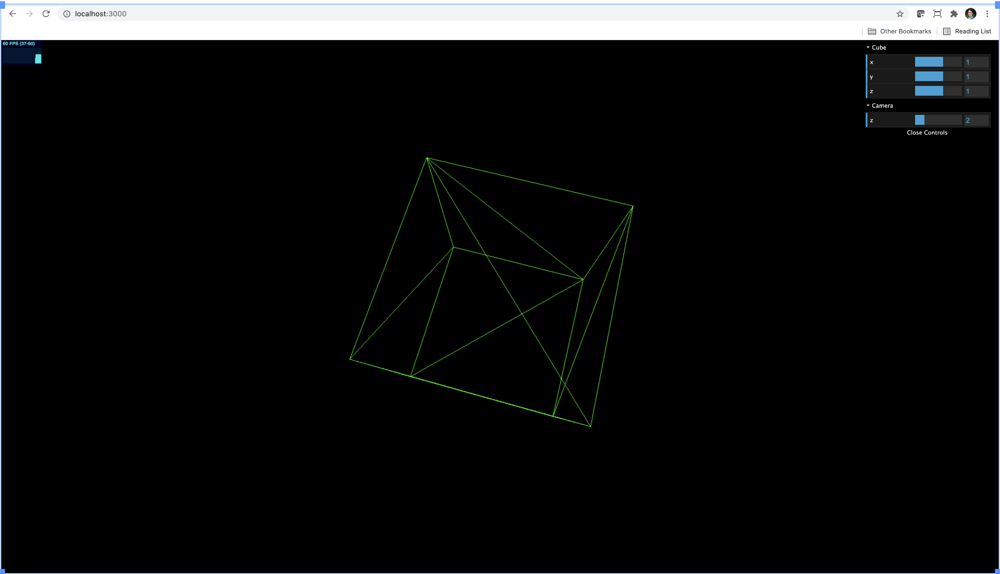
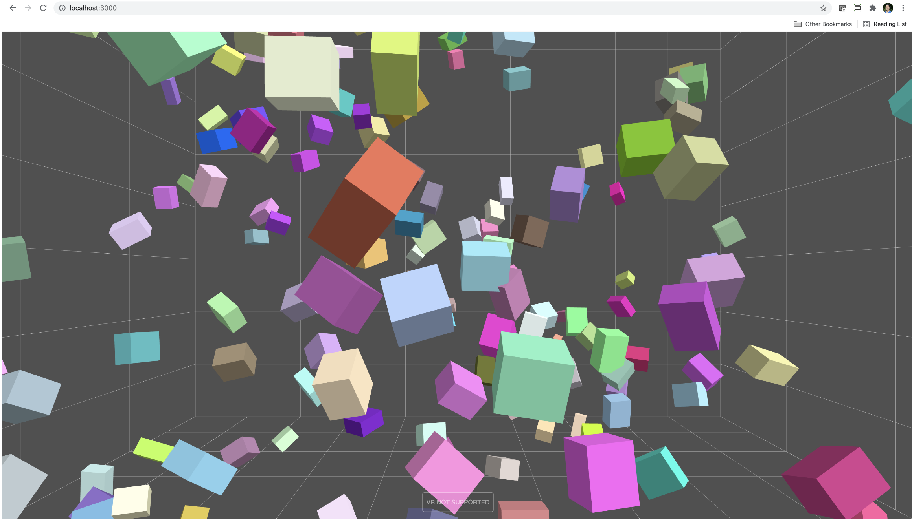

---

**Aim:**

The aim of this tutorial is to learn to
implement a basic interoperable 
web-based 3D environment using WebGL. 


WebGL (Web Graphics Library) is a JavaScript API 
for rendering interactive 2D and 3D graphics within 
any compatible web browser without the use of plug-ins.

WebGL is fully integrated with other web standards, allowing 
GPU-accelerated usage of physics and image processing and 
effects as part of the web page canvas. It uses the HTML5 canvas element. 

In this tutorial, you will follow a few steps to 
implement 3D environments, 
including support for Virtual Reality (VR), on the web. 

**Requirements:**

You will need basic awareness of how a webserver works, as well
as basic knowledge of HTML and Javascript.

You can use Three.JS (https://threejs.org/) or AFrame (https://aframe.io/) 
for your application, although we'll do an example using mostly THREE.JS.

---


## Step 1. Create a website

Using the basic [instructions to create a website][website-basic],
generate basic code to run a sample webpage.


Through this, you will be able to test your 
own html example, 
such as [this example](https://vrtest.kre.brighton.domains) following the next steps: 

<iframe src="https://vrtest.kre.brighton.domains"
style="width: 100%; 
height: 768px;" 
/>


## Step 2. Install Node.JS in your PC


Download an install [NodeJS](https://nodejs.org/en/download)

Node.JS uses a [standard package manager](https://nodejs.org/en/learn/getting-started/an-introduction-to-the-npm-package-manager) which is called with the command npm.

To install a single package, you need to type in the console:

``` console
npm install <package-name>

```

You can use an existing boiler plate Three.JS 
code which has been configured for Node.JS to understand 
how it works and modify according to your needs, 
for example

[GitHub - Sean-Bradley/Threejs-Boilerplate](https://github.com/Sean-Bradley/Threejs-Boilerplate)

Create a folder which you will access from an IDE, such as Visual Studio Code.
Then clone this code from the github repository by typing in the console:

``` console
git clone https://github.com/Sean-Bradley/Threejs-Boilerplate.git

```


Once you download the code, you can use npm to install and start:


``` console
$ cd Threejs-Boilerplate
$ npm install
$ npm start
```

npm start 
runs a predefined command specified in 
the "start" property of a package's "scripts" object.

It normally creates a local webserver, e.g. http://127.0.0.1:3000
where the website is located.

Once you run this code, you should see the default example.

{alt="three.js basic ex"}

## Step 3.Modify your code to run a VR example

Using the VR examples in Three.JS: https://threejs.org/examples/ find a VR example which you want to work with, such as:

https://threejs.org/examples/?q=vr#webxr_vr_cubes and look at the code: 

https://github.com/mrdoob/three.js/blob/master/examples/webxr_vr_cubes.html

You can copy the code within the <script> tag and include it in your client.js file. When running the example using $npm start you should see the new example running:

{alt="three.js basic ex"}

### Step 4. Examine the code

Examine the code and make any modification you want to implement before deploying on the server. 


This can include changing the type of geometry, the number or the material you use:


``` javascript

  const geometry  =  new   THREE . BoxGeometry (  0.15 ,  0.15 ,  0.15  );


  for  (  let   i  =  0 ;  i  <  200 ;  i  ++ ) {


  const   object  =  new   THREE . Mesh (  geometry ,  new   THREE . MeshLambertMaterial ( {  color :   Math . random () *  0xffffff  } ) );


```

### Step 5. Upload your code to the webserver

To deploy your code, you will need to copy/paste your code to the brighton.domains server. For this, you can upload evert file or use scp on the command line so that the content is copied recursively.


Now, in the brighton.domains dashboard look for the Node.JS functionality and create a new application with the content on the folder.

{alt="three.js basic ex"}

After the application starts, you should be able to test it using a cardboard VR or headset through the http address.


<!--


This will run the Node.JS application and you can see the site by opening your browser and going to: http://127.0.0.1:3000

You should see the default example:

Exercise 3. Modify your code to run a VR example

Using the VR examples in Three.JS: https://threejs.org/examples/ find a VR example which you want to work with, such as:

https://threejs.org/examples/?q=vr#webxr_vr_cubes and look at the code: https://github.com/mrdoob/three.js/blob/master/examples/webxr_vr_cubes.html

You can copy the code within the <script> tag and include it in your client.js file. When running the example using $npm start you should see the new example running:


Exercise 4. Examine the code

Examine the code and make any modification you want to implement before deploying on the server. This can include changing the type of geometry, the number or the material you use:


``` javascript

  const geometry  =  new   THREE . BoxGeometry (  0.15 ,  0.15 ,  0.15  );


  for  (  let   i  =  0 ;  i  <  200 ;  i  ++ ) {


  const   object  =  new   THREE . Mesh (  geometry ,  new   THREE . MeshLambertMaterial ( {  color :   Math . random () *  0xffffff  } ) );


```


Excercise 5. Upload your code to the webserver

To deploy your code, you will need to copy/paste your code to the brighton.domains server. For this, you can use scp on the command line so that the content is copied recursively.


Now, in the brighton.domains dashboard look for the Node.JS functionality and create a new application with the content  on the folder.


 

After the application starts, you should be able to test it using a cardboard VR or headset through the http address.
-->

